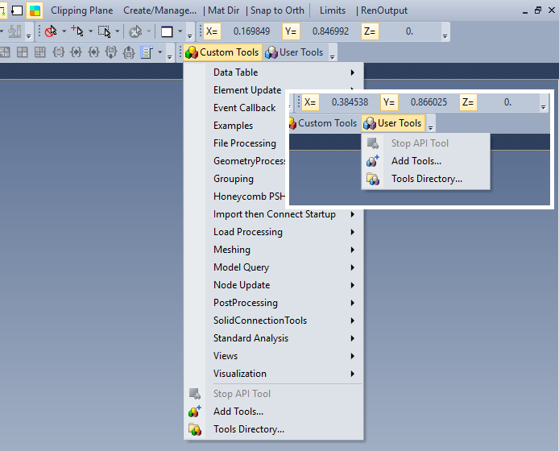
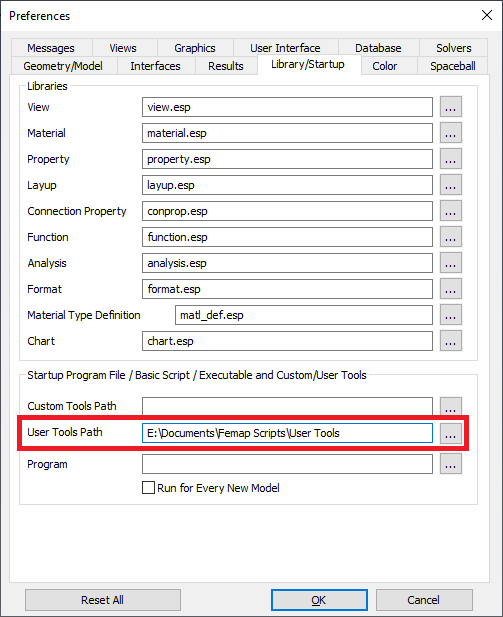
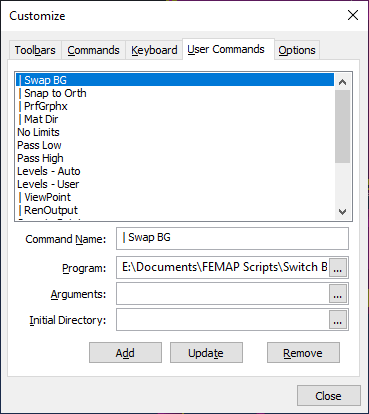
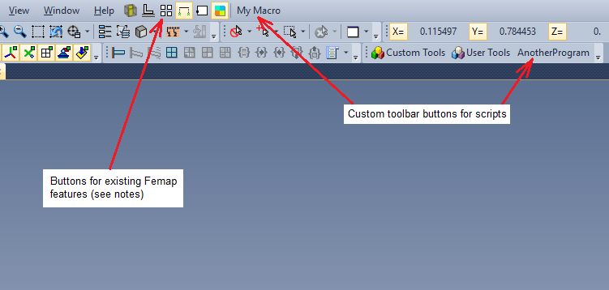

## How to use Femap API Scripts

Femap scripts are an extremely powerful tool with many potential uses. Scripts can be used to automate tedious tasks, improve the user interface of a feature, perform complex analysis or modeling tasks, combine often-used sequences into a single operation, and many other productivity-driven purposes.

`This guide will teach you how to use scripts that are already written. It is not a guide to writing your own.`

Using a script is usually quite easy\*. The files are plain-text scripts written in a version of Visual Basic, so the easiest way is to simply copy the code into Femap's API window and run it. For sripts that will be used often, you can also add them to your Use Tools menu or even add a custom toolbar button. All three of these methods are covered in this repository.
>\*Advanced scripts may rely on separate subroutine files, class modules, or external libraries. These dependencies should be clearly explained in the program's documentation.

#### Terminology
A note on terminology: *code*, *script*, and *macro* are used interchangeably in this document. All refer to a set of instructions executed by the Femap API interpreter.

### Method 1:  Run From the API Pane
The API Pane in Femap can be used to view, edit, or run macros. To access the API window, click on the API Programming tab. If the tab isn't visible, click the indicated icon above the "Model Info" pane.

The API window opens with some default code that's required for a new macro, which may be ignored for our purposes. To load a macro code, either click the Open icon (that looks like a folder with an arrow pointing up) and navigate to the file, or open the file externally in a text editor and paste the entire code into the window, replacing what's already there. Once you've done one of these steps, click the green arrow to run the code.

Once you've run the code you can close the API window and continue with your analysis. Note that macros are not saved with your model file, so if you close that instance of Femap and open the same model later, the macro code will not be loaded in the window. Loading a macro will also not increase your model file size.

### Method 2:  Add to the User Tools Menu
Scripts that will be used more than once can be accessed conveniently from the toolbar. The _Custom and User Tools_ toolbar in Femap contains two buttons for easily accessing your scripts. The `Custom Tools` drop-down menu contains a number of API scripts that are included with Femap. It's possible to add scripts to this button, but I prefer to add my scripts to the `User Tools` drop-down list instead (they are scripts added by me -the user- afterall).
>Note: These buttons have options (_Tools Directory..._) to define the tools directory. If you define the directory this way, it will work for the current session but it will not be preserved when you exit Femap.

To add a script, save it somewhere on your local machine. It's best to make a dedicated directory for your scripts, something like `Documents/Femap Scripts/User Tools`.

Next, tell Femap where this directory is located by clicking _File_ > _Preferences_ (Or `Ctrl + Shift + P`). On the _Library/Startup_ tab, enter the directory in the _User Tools Path_ field.

Femap will check this directory every time you click _User Tools_ and display the programs if finds.

#### User Tools Notes
1.  Femap will recognize the following file extensions and display them in the drop-down menu:  `*.exe`, `*.com`, `*.pif`, `*.bat`, `*.cmd`, `*.pro`, `*.prg`, and `*.bas.`
2.  You can make folders in the User Tools directory and Femap will create a sub-menu for those tools. The sub menu will be the name of the folder.
3.  The _Add Tools..._ option in the drop-down menu allows you to easily add a saved script to the User Tools directory you defined. When you click this option and navigate to a file, Femap will copy that file into your User Tools directory.
4.  Much more information about the tools directory can be found in the Femap Help: `Home > Commands > 7. Modeling Tools > 7.3 Tools, Toolbars... > 7.3.1 Standard Toolbars > 7.3.1.22 Tools, Toolbars, Custom and User Tools`

### Method 3:  Create a Toolbar Button
Perhaps the most convenient way to access a script is to add a button to run the script to the toolbar. This makes your script accessible with a single click. To add a toolbar button, follow these steps.
1.  Save the program locally on your computer
2.  In Femap, right-click anywhere in the toolbar area and click _Customize..._
3.  On the User Commands tab, enter a short name for the program in the Command Name field.
4.  Enter the path (or click the three-dots button and navigate) to your program.
>Note:  If you already have some user commands, just overwrite the existing text.
5.  Click Add. You should see your program added to the list on this tab.

The next step is on the Commands tab, but as of Femap 12.0.1a the list of commands on this tab doesn't update unless the Customize dialogue box is closed and re-opened. So close it and then repeat step 2 before continuing.

6.  On the Commands tab, click _User Commands_ in the Categories window to populate the Commands window with your custom commands.
7.  Find your new command in the list, then click and drag it up to the toolbar area. You can place it on any visible toolbar or on the Menu Bar (The row with File, Tools, Geometry, etc.).
8.  Click Close to exit the Customize dialogue.

#### Toolbar Notes
1.  You can add almost any built-in feature of Femap to the toolbar this way. Just find the command you want in the Commands list on the Commands tab, and click-and-drag it up to the toolbar area.
2.  There are many options to make your custom toolbar buttons more useful such as organizing them in custom drop-down menus and adding custom icons. See Femap Help: `Home > User Guide > 4. User Interface > 4.2 Accessing FEMAP Commands > 4.2.2 FEMAP Toolbars > 4.2.2.2 Customizing toolbars` for more info.

### Good Luck!
If you have any questions, create an Issue and I will try to address them. Comments and improvements to this document are welcome, just make a pull request.
