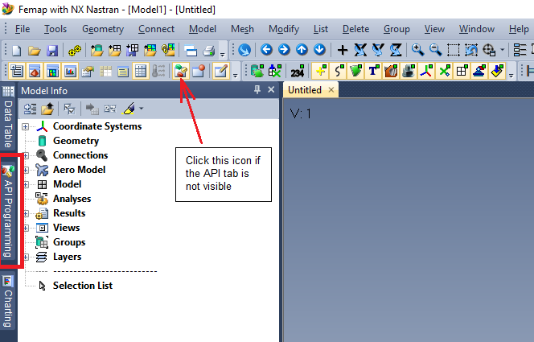
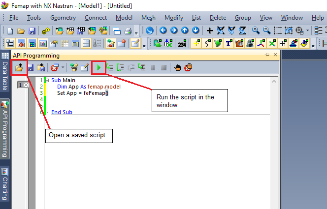

## How to use Femap API Scripts

Femap scripts are an extremely powerful tool with many potential uses. Scripts can be used to automate tedious tasks, improve the user interface of a feature, perform complex analysis or modeling tasks, combine often-used sequences into a single operation, and many other productivity-driven purposes.

Using a script is usually quite easy\*. The files are plain-text scripts written in a version of Visual Basic, so the easiest way is to simply copy the code into Femap's API window and run it. For sripts that will be used often, you can also add them to your Use Tools menu or even add a custom toolbar button. All three of these methods are covered in this repository.
>\*Advanced scripts may rely on separate subroutine files, class modules, or external libraries. These dependencies should be clearly explained in the program's documentation.

#### Terminology
A note on terminology: *code*, *script*, and *macro* are used interchangeably in this document. All refer to a set of instructions executed by the Femap API interpreter.

### Method 1:  Run From the API Pane
The API Pane in Femap can be used to view, edit, or run macros. To access the API window, click on the API Programming tab. If the tab isn't visible, click the indicated icon above the "Model Info" pane.

The API window opens with some default code that's required for a new macro, which may be ignored for our purposes. To load a macro code, either click the Open icon (that looks like a folder with an arrow pointing up) and navigate to the file, or open the file externally in a text editor and paste the entire code into the window, replacing what's already there. Once you've done one of these steps, click the green arrow to run the code.

Once you've run the code you can close the API window and continue with your analysis. Note that macros are not saved with your model file, so if you close Femap and open the same model later, the macro code will not be loaded in the window. Loading a macro will also not increase your file size.
